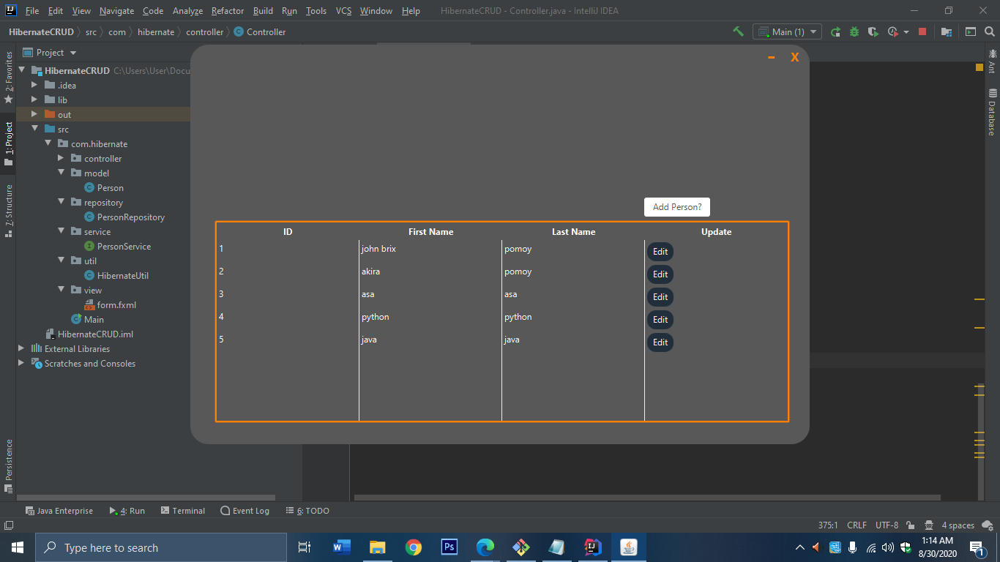

# HibernateCRUD
Hibernate ORM as backend my front end is Java FX.

<h1>How to install: </h1>

<h3> First download the project, open or import in your Intellij IDEA.  </h3>

 <h3>Second install the following libraries: </h3>

<h3> • <dependency>
    <groupId>org.hibernate</groupId>
    <artifactId>hibernate-core</artifactId>
    <version>5.4.18.Final</version>
</dependency> </h3>

<h3> • <dependency>
	<groupId>mysql</groupId>
	<artifactId>mysql-connector-java</artifactId>
	<version>5.1.23</version>
</dependency> </h3>

<h2> Actual image: </h2>

<h2>How to delete if you dont see: </h2>

<h4> Select the following data that you want to delete, then Right Click mouse now you can delete.</h4>
